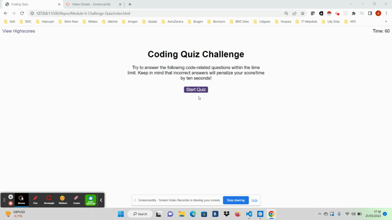

# Module-6-Challenge-Quiz

## Project Description

JavaScript based multiple choice quiz site that uses JavaScript to render questions and choices from an array of questions.  The choices are rendered as buttons with event listeners that, when selected, run checks against an expected answer, give "correct"/"incorrect" visual and sound effect responses and then proceeds to the next question until the array of questions has been completed.  The page uses as an interval based timer to count down from 60 until 0 or until all questions are answered.  Time is subtracted for wrong asnwers and the number of seconds left at the end of the quiz is the user's score.  At the end of the quiz, the user can input their initials alongside their score which is then saved to local storage to be used and displayed in a high scores page.

## Table of Contents

* [Project Description](#project-description)
* [Installation](#installation)
* [Usage](#usage)
* [License](#license)
* [Contributing](#contributing)
* [Tests](#tests)
* [Questions](#questions)

## Installation

see webpage: https://42-djc.github.io/Module-6-Challenge-Quiz/

## Usage

The site can be used from a live server. See demo [GIF](./assets/images/GIF.gif)

 

## License

n/a

## Contributing

n/a

## Tests

n/a

## Questions

https://github.com/42-djc

For further questions, please email: daniel.j.colman@googlemail.com

